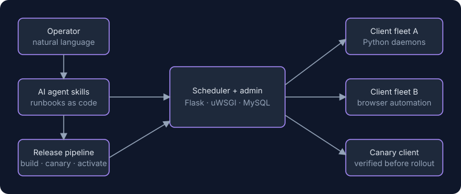
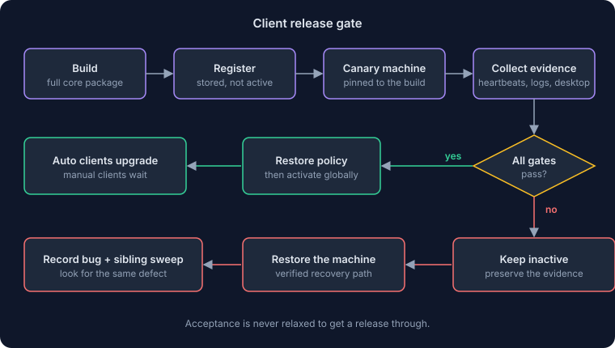
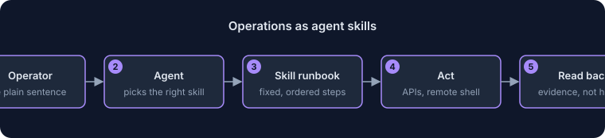

# AutoPin-CS

[English](README.md) · [中文](README.zh.md) · [Español](README.es.md) · [Deutsch](README.de.md) · Français

[GitHub @frommmmmg](https://github.com/frommmmmg)

✍️ Par **姜芊泽 (Jiang Qianze)** · compte officiel WeChat: **Pin海引航**

> **Ce dépôt est une vitrine, pas une publication de code source.** AutoPin-CS n'est pas open source : il n'y a donc pas de code ici, seulement ce qu'il fait, comment il est construit et à quoi il ressemble. Pour en discuter, contactez-moi via mon [profil GitHub](https://github.com/frommmmmg).

**Un planificateur et gestionnaire de flotte pour l'exploitation de contenu sur les réseaux sociaux à grande échelle.** Un serveur central distribue le travail à une flotte de clients Windows, et une couche d'agents IA permet à un opérateur de piloter tout le système en langage courant.

Exploiter une grande flotte de clients de bureau sans surveillance est avant tout un problème d'exploitation. Comment déployer une nouvelle version sans mettre la flotte à l'arrêt ? Comment mettre en service une machine neuve toujours de la même façon ? Comment repérer la seule machine qui défaille en silence ? AutoPin-CS est le système construit autour de ces questions, et l'essentiel de son code sert à rendre les réponses reproductibles, vérifiables et récupérables.

| | |
|---|---|
| **Mon rôle** | Seul concepteur et mainteneur du serveur, du client, du contrôle du bureau, des outils de déploiement et de la documentation |
| **Statut** | En production. Un système commercial privé, donc pas de site public |
| **Échelle** | Environ 1 300 fichiers Python, environ 620 fichiers de tests, plus de 400 décisions d'architecture et environ 290 analyses de bogues |
| **Technologies** | Python · Flask · uWSGI · MySQL · services Windows · automatisation du navigateur · FFmpeg |

### Ce qu'il fait

**Serveur**
- **Planification et administration centrales.** Un service Flask/uWSGI adossé à MySQL gère les tâches, les commandes, le registre des clients, les journaux et résultats de tâches, les sauvegardes et les statistiques.
- **Contrats et discipline de schéma.** Le schéma de chaque table est versionné et appartient à un module, et le contrôle de disponibilité retient les planificateurs tant que la base n'est pas dans l'état attendu.

**Flotte de clients**
- **Des démons Python avec plusieurs modes de fonctionnement**, qui exécutent des flux d'automatisation du navigateur : un worker de longue durée, un mode tâche unique piloté par le serveur et d'autres types de tâches.
- **Un agent de bureau qui traverse l'isolation de session de Windows.** Il peut voir et piloter le vrai bureau de l'utilisateur : le diagnostic à distance comprend donc des captures d'écran et le contrôle des processus plutôt que des suppositions tirées des journaux.
- **Préparation vidéo.** Un flux par lots vérifié normalise les vidéos vers un profil H.264/AAC prudent, accepté même par d'anciennes combinaisons Windows et navigateur.

**Ingénierie des versions**
- **Un contrôle de version qui ne cède jamais.** Chaque mise à jour client est construite en paquet complet, enregistrée inactive, **vérifiée sur une vraie machine canari** et seulement ensuite activée, avec retour arrière prêt. Une compilation réussie, un paquet qui se décompresse ou un simple battement de cœur ne comptent pas comme un succès.

**Une couche d'agents IA**
- **L'exploitation sous forme de compétences d'agent.** Mettre en service une machine neuve, diagnostiquer un client distant, contrôler les planificateurs, trier les comptes en difficulté et préparer une version sont écrits comme des compétences qu'un agent IA peut exécuter. Chaque compétence est une suite fixe d'étapes avec des contrôles de vérification et une relecture des preuves, lancée par une phrase de l'opérateur.

## Captures d'écran

*Pas de captures d'écran, volontairement : la console d'administration affiche des données de clients et de comptes.*

## Comment ça marche

*Une version n'est activée qu'après qu'une vraie machine canari a franchi tous les contrôles.*

*L'opérateur parle simplement ; l'agent exécute un guide fixe et relit les preuves.*

<!--notes-->
## Notes d'ingénierie

- **Les décisions sont écrites, et elles sont nombreuses.** Plus de 400 décisions d'architecture expliquent pourquoi les choses sont ce qu'elles sont, beaucoup concernent le versionnage et la propriété des schémas de base de données pour que le démarrage et les migrations restent prévisibles.
- **Chaque bogue a une analyse et une recherche de jumeaux.** Environ 290 fiches de bogues nomment chacune la cause racine, le test de régression et la recherche du même défaut ailleurs. Un bogue n'est clos qu'une fois cette recherche faite.
- **Des preuves plutôt que de l'espoir.** Une version ne compte comme bonne qu'avec des preuves d'une vraie machine : arbre de processus stable, session de bureau, succès persisté, aucun échec ou retour arrière plus récent. Les contrôles du paquet incluent les listes de membres, les sommes ZIP, la longueur, le SHA-256 et la compatibilité avec l'interpréteur le plus ancien de la flotte.
- **La reprise est conçue avant d'être nécessaire.** Les chemins de retour arrière, une voie de restauration vérifiée pour la machine canari et un guide de reprise avec installateur complet sont écrits, et les journaux de l'échec d'origine sont conservés plutôt qu'écrasés.
- **Les secrets restent hors du code et de la ligne de commande.** Les identifiants vivent dans le trousseau du système et ne sont remis aux outils qu'au moment de l'usage.
- **Les agents suivent les mêmes règles que les personnes.** Les compétences des agents sont versionnées dans le dépôt, portent les mêmes règles de sécurité (ne jamais sauter le canari, ne pas deviner de quel point d'entrée vient un journal) et doivent se terminer en confirmant que le changement a été poussé.

<!--author-->
## À propos de l'auteur

**姜芊泽 (Jiang Qianze)** est un pseudonyme. Je suis un développeur indépendant qui crée des outils, des données et de l'automatisation pour les marques, marchands et créateurs qui visent l'international. Chaque projet de ces vitrines a été conçu, construit et exploité par moi seul, de l'idée du produit jusqu'aux serveurs et à la documentation.

J'écris sur ce travail sur mon compte officiel WeChat, **Pin海引航** (en chinois). Scannez le code pour le suivre, ou retrouvez-moi sur [GitHub](https://github.com/frommmmmg).

 
<!--/author-->

**Autres vitrines:** [AffProof](https://github.com/frommmmmg/AffProof-showcase) · [Tonu.app](https://github.com/frommmmmg/Tonu.app-showcase) · [AffiliateScraper](https://github.com/frommmmmg/AffiliateScraper-showcase)

---

Les captures n'utilisent que des données d'exemple ou publiques. © Tous droits réservés. Les descriptions peuvent être citées avec attribution ; le logiciel lui-même ne peut pas être redistribué.

